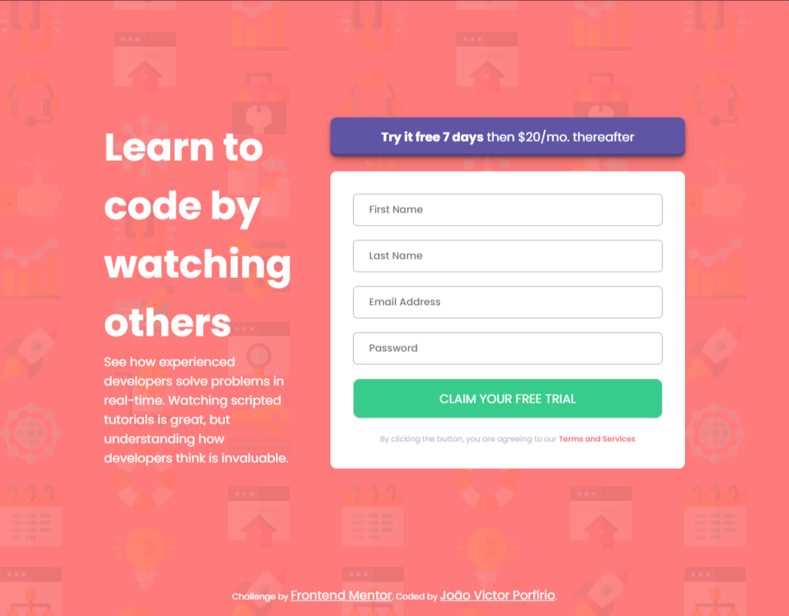

<h1 align="center"> Página de criação de conta</h1>

Desafio 03 - Frontend Mentor

  <a href="#-tecnologias">Tecnologias</a>&nbsp;&nbsp;&nbsp;|&nbsp;&nbsp;&nbsp;
  <a href="#-projeto">Objetivos e Desafios </a>&nbsp;&nbsp;&nbsp;|&nbsp;&nbsp;&nbsp;
  <a href="#-projeto">Projeto</a>&nbsp;&nbsp;&nbsp;|&nbsp;&nbsp;&nbsp;

 

 
  
  
  

## 🚀 Tecnologias

Esse projeto foi desenvolvido com as seguintes tecnologias:

- HTML
- CSS
- JavaScript

## 🎯 Objetivos e Desafios 

O projeto em questão foi escolhido para exercitar conceitos de html e css, e principalmente tratar validações com JavaScript. Com relação a estruturação e estilização foi bem tranquila. Para o tratamento de validações já havia feito algumas vezes com javascript porém utilizando muito código, e nesse projeto consegui reduzir e tornar mais objetivo! 😎

## 💻 Projeto

O projeto é uma página de apresentação com um formulário de cadastro para que o usuário adquira a versão de teste de um determinado produto.
Você pode visualizar o projeto no ar [AQUI](https://frontend-mentor-desafios-aboh.vercel.app/)
