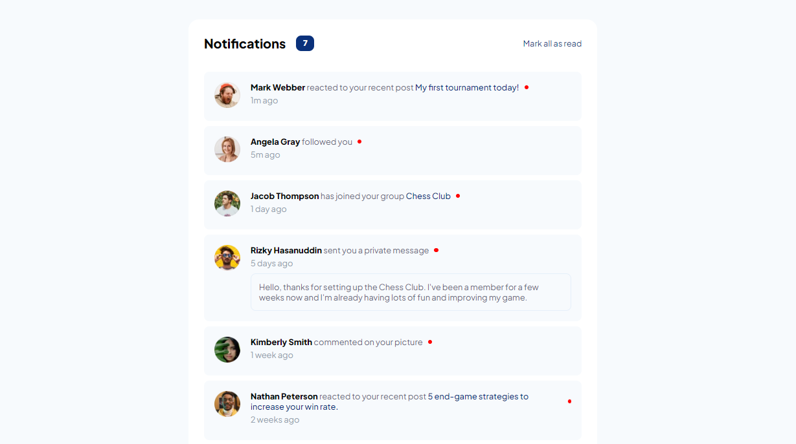

<h1 align="center"> Página de notificações</h1>

Desafio 04 - Frontend Mentor

  <a href="#-tecnologias">Tecnologias</a>&nbsp;&nbsp;&nbsp;|&nbsp;&nbsp;&nbsp;
  <a href="#-projeto">Objetivos e Desafios </a>&nbsp;&nbsp;&nbsp;|&nbsp;&nbsp;&nbsp;
  <a href="#-projeto">Projeto</a>&nbsp;&nbsp;&nbsp;|&nbsp;&nbsp;&nbsp;

 

 
  
  
  

## 🚀 Tecnologias

Esse projeto foi desenvolvido com as seguintes tecnologias:

- HTML
- CSS
- JavaScript

## 🎯 Objetivos e Desafios 

Este projeto foi muito útil para exercitar JavaScript e tratar de manipulações de estados(lido/não lido). Ainda quero aperfeiçoar com a possibilidade de fazer este tratamento com cada notificação separado e alterar o número de notificações não lidas no superior da página. Porém como primeira parte e principal do desafio, foi concluído com sucesso!

## 💻 Projeto

O projeto é uma página de notificações em que o usuário pode ver as ultimas mensagens ou notificações lidas e não lidas, além de possibilitar a alteração para todas lidas.

