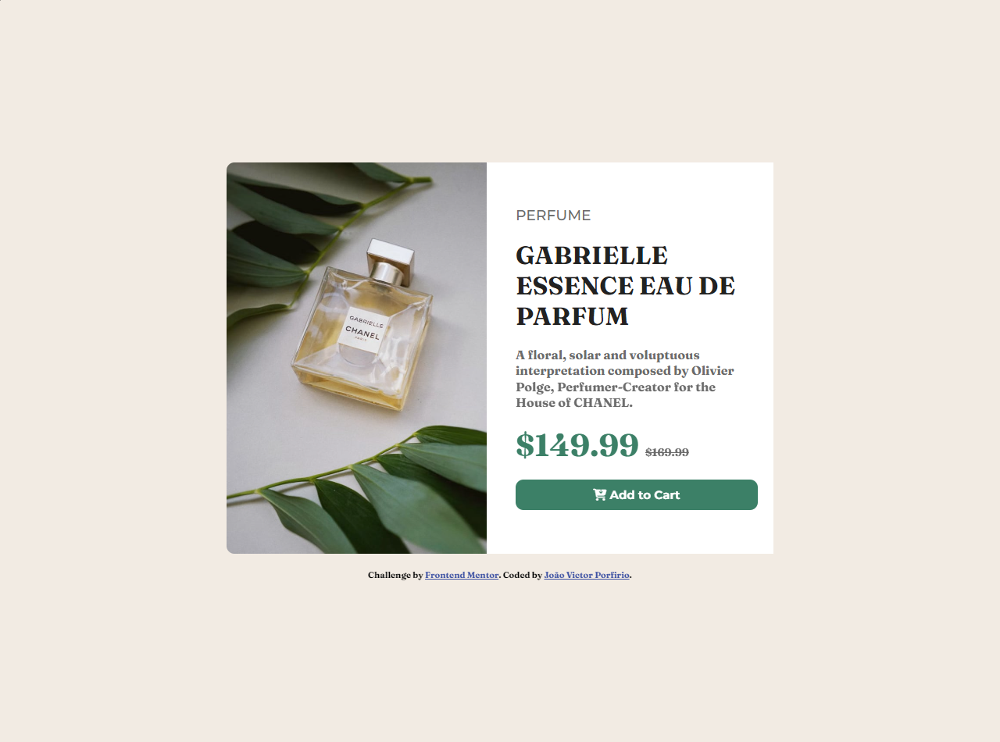
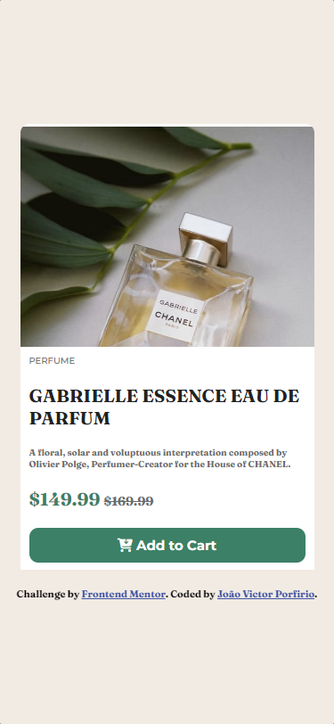

<h1 align="center"> Card de produto</h1>

Desafio 01 - Frontend Mentor

  <a href="#-tecnologias">Tecnologias</a>&nbsp;&nbsp;&nbsp;|&nbsp;&nbsp;&nbsp;
  <a href="#-projeto">Projeto</a>&nbsp;&nbsp;&nbsp;|&nbsp;&nbsp;&nbsp;

 

 
  
  

## 🚀 Tecnologias

Esse projeto foi desenvolvido com as seguintes tecnologias:

- HTML
- CSS

## 💻 Projeto

O projeto tem o objetivo de apresentar o produto e seus detalhes. É um ótimo componente para ser adicionado em um Ecommerce.
Você pode visualizar o projeto no ar [AQUI](https://frontend-mentor-desafios.vercel.app/)
